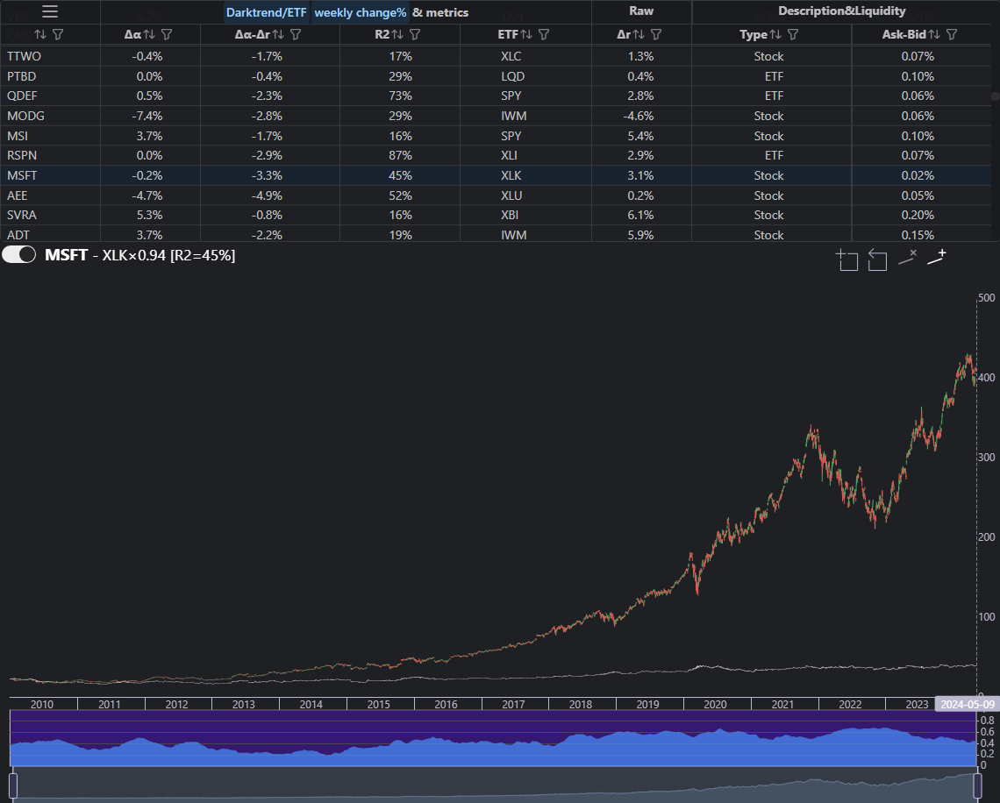
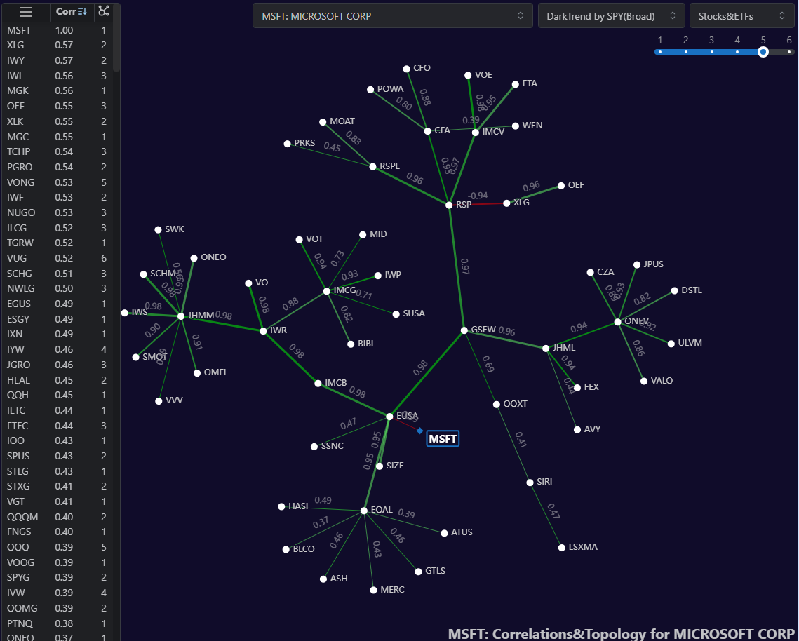

Usage
=====

.. _installation:

Installation
------------

To use DarkTrend API, first install it using pip:

.. code-block:: console

   (.venv) $ pip install ████

DarkTrend Explorer
------------------

For browsing charts with dark trends and for scanning/screening, use `DarkTrend Explorer <https://darktrend.com/explorer>`_.

DarkTrend Explorer
------------------

For browsing correlations, market topology (raw or based on dark trends) use `DarkTrend Correlation <https://darktrend.com/correlation>`_.

